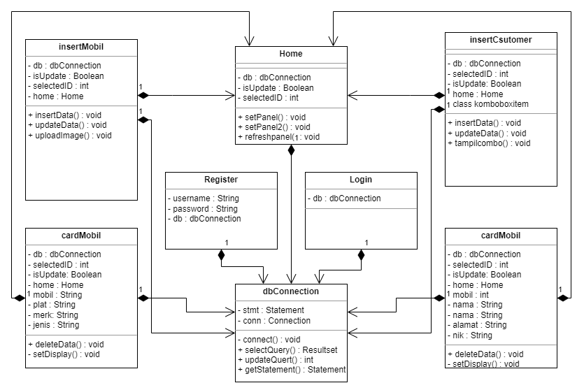

# TP2DPBO2023
Saya Nadhief Athallah Isya NIM 2106413 mengerjakan TP2 dalam mata kuliah Desain dan Pemrograman Berorientasi Objek untuk keberkahanNya maka saya tidak melakukan kecurangan seperti yang telah dispesifikasikan. Aamiin.

## Deskripsi Tugas
Buatlah program Java yang terkoneksi dengan database MySQL. Berikut spesifikasi program yang harus dibuat:
* Program bebas, kecuali program Mahasiswa dan Book Author
* Terdapat proses Create, Read, Update, dan Delete data
* Terdapat proses Autentikasi (Login, Register)*
* Menggunakan minimal 2 tabel pada database
* Harus terdapat minimal 1 properti gambar pada class yang dibuat (gambar akan ditampilkan pada UI)
* Terdapat pergantian screen pada UI
* Terdapat button navigasi untuk beralih screen
* List data ditampilkan menggunakan card (JPanel). Contoh card dengan JPanel link\
*Boleh login dan/atau register. Tidak perlu ada enkripsi password
## Design Program

## Run Program
Jalankan program jar atau run file main.java didalam project

## Design Program
Pada program ini terdapat 8 class dengan class `Home` sebagai main class/Main Panel. awal mula program dijalankan akan langsung masuk ke login page terlebih dahulu.

* `Login`		: Class ini berupa JFrame yang di dalamnya terdapat atribut db (merupakan instansiasi dari class dbConnection). Pada class ini terdapat fieldText uesername dan password lalu dua button yaitu login dan register. jika sudah memiliki akun isi field username dan password lalu pencet tombol login maka langsung masuk ke home, jika belum memiliki akun pencet tombol register maka akan masuk ke halaman register. username dan password yang bisa login hanya data yang sudah terdaftar di database.

* `Register`	: Class ini berupa JFrame yang di dalamnya terdapat atribut db (merupakan instansiasi dari class dbConnection) dan terdapat dua atribut username dan password untuk menampung nilai yang ada pada fieldText. Pada class ini terdapat fieldText uesername, password, dan verifikasi password lalu ada satu button yaitu register. field harus terisi semua dan bagian password harus sama dengan ver password agar bisa register. setelah pencet tombol register maka data akan dimasukan ke dalam database lalu kembali ke halaman login.

* `Home`		: Class ini berupa JFrame yang merupakan panel utama, berisi 2 JScrollPane untuk menyimpan card mobil dan customer. Terdapat 3 atribut yaitu db (merupakan instansiasi dari class dbConnection), isUpdate(boolean) buat nentuin apakah data yang kita pencet itu lagi diupdate atau ngga, dan selectedID untuk nunjuk id data. Pada class ini terdapat button mobil dan customer sebagai navigation bar untuk add data, dalam halaman home ini data yang ada pada card mobil dan customer akan langsung ditampilkan setelah add, ubah, dan hapus data. di class ini terdapat 3 method yaitu setPanel(), setPanel2(), dan refreshPanel().

* `CardMobil`	: Class ini merupakan JPanel yang berisi tampilan data mobil yaitu nama_mobil, plat_nomer, merk_mobil, dan jenis_mobil. Pada class ini terdapat 8 attribut yang terdiri dari db yang sebagai penyambung antara program dengan database dan sekaligus pengeksekusi syntax sql, home merupakan instansiasi agar dapat menggunakan method home di cardmobil, selectedID merupakan penanda id data tersebut, isUpdate langsung disetting true, mobil untuk menyimpan data mobil, plat untuk menyimpang data plat nomer, merk untuk menyimpang data merk mobil, jenis untuk menyimpan data jenis mobil. lalu terdapat 2 button hapus dan ubah untuk mengubah serta menghapus data. jika pencet tombol ubah maka akan langsung pindah ke halaman insert mobil. dalam class ini terdapat method set display untuk menampilkan data yang ada dalam database, method delete data untuk menghapus data

* `CardCustomer`	: Class ini merupakan JPanel yang berisi tampilan data customer yaitu nama_customer, alamat customer, nik customer, dan mobil yang dipilih. Pada class ini terdapat 8 attribut yang terdiri dari db yang sebagai penyambung antara program dengan database dan sekaligus pengeksekusi syntax sql, home merupakan instansiasi agar dapat menggunakan method home di cardcustomer, selectedID merupakan penanda id data tersebut, isUpdate langsung disetting true, mobil bertipe integer untuk menyimpan nilai id mobil yang dipilih, nama untuk menyimpan nama customer, alamat untuk menyimpan alamat customer, dan nik untuk menyimpan nik customer. lalu terdapat 2 button hapus dan ubah untuk mengubah serta menghapus data. jika pencet tombol ubah maka akan langsung pindah ke halaman insert customer. dalam class ini terdapat method set display untuk menampilkan data yang ada dalam database, method delete data untuk menghapus data

* `InsertMobil`	: Class ini merupakan JFrame yang berisi field form untuk menginputkan (Versi Input) atau mengubah data (Versi Update) dari table mobil di database. Pada class ini terdapat 4 atribut yaitu home merupakan instansiasi agar dapat menjalankan method home di insertmobil, db (sebagai penyambung antara program dengan database dan sekaligus pengeksekusi syntax sql), isUpdate sebagai penanda apakah user sedang menambahkan sebuah data atau mengedit/mengubah sebuah data, selectedID sebagai penanda ketika user akan mengubah/mengedit sebuah data/id didalam table mobil.
dalam kelas ini terdapat 2 button cancel dan add/ubah.ketika pencet tombol add maka data akan bertambah lalu kembali ke home, jika pencet tombol ubah maka data akan berubah, jika pencet tombol cancel maka akan kembali ke home. ada 2 method insertdata dan update data.

* `InsertCustomer`	: Class ini merupakan JFrame yang berisi field form untuk menginputkan (Versi Input) atau mengubah data (Versi Update) dari table mobil di database. Pada class ini terdapat 4 atribut yaitu home merupakan instansiasi agar dapat menjalankan method home di insertcustomer, db (sebagai penyambung antara program dengan database dan sekaligus pengeksekusi syntax sql), isUpdate sebagai penanda apakah user sedang menambahkan sebuah data atau mengedit/mengubah sebuah data, selectedID sebagai penanda ketika user akan mengubah/mengedit sebuah data/id didalam table mobil.
dalam kelas ini terdapat 2 button cancel dan add/ubah.ketika pencet tombol add maka data akan bertambah lalu kembali ke home, jika pencet tombol ubah maka data akan berubah, jika pencet tombol cancel maka akan kembali ke home. ada 3 method insertdata, updatedata, dan tampilcombo(). kelas ini juga terdapat 1 kelas baru komboboxitem untuk memisahkan key dan value sehingga saat memilih value dalam combobox yang masuk ke database adalah key nya.

* `dbConnection`	: Class ini digunakan sebagai penyambung antara program/apk dengan database. Class ini juga memiliki attribut yaitu statement yang disingkat menjadi stmt dan connection yang disingkat menjadi conn. serta method - method yang terdapat pada class ini akan membantu mengeksekusi query yang akan dilakukan pada JFrame lainnya, karena jika tanpa class ini dan menggunakan executeQuery saja pada JFrame lain, syntax tsb hanya bisa digunakan sekali saja (berdasarkan stackoverflow).

Selain di atas terdapat juga fitur tambahan sepert error handling untuk login dan register, trigger untuk mengubah status boolean ketika add data / hapus data.

relasi tabel mobil dan customer one to one. jadi satu orang cuman bisa rental 1 mobil.

## Alur Program
jadi ceritanya ini teh ada orang yang mau rental mobil nah input datanya teh sama si customer service nya jadi bisa add mobil, add customer.
1. User akan ditampilkan menu login dan jika user belum mempunyai akun untuk login, maka user diharuskan button `register` untuk beralih Frame ke Frame register (pada field yang terdapat pada Frame ini, user diharuskan mengisi kesemua data).
2. Jika user sudah mempunyai akun untuk login, user dapat login dengan akun yang telah dimilikinya dan user akan dialihkan kedalam Frame Home/Main Panel.
3. di home dapat menambahkan data mobil dan data customer lalu setiap udah add,ubah,hapus bakal langsung balik lagi ke home

* contoh akun untuk login
1. username: ok	password: ok

